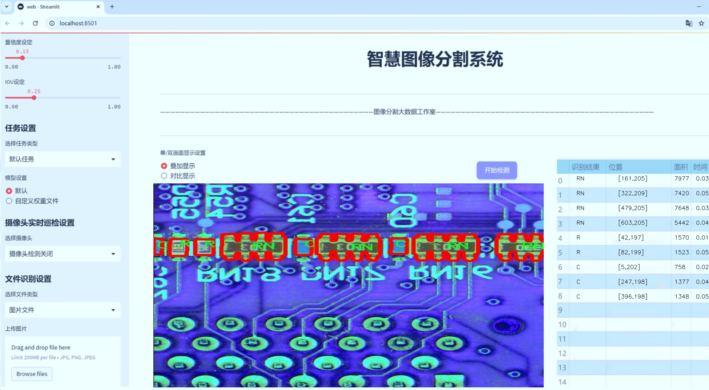
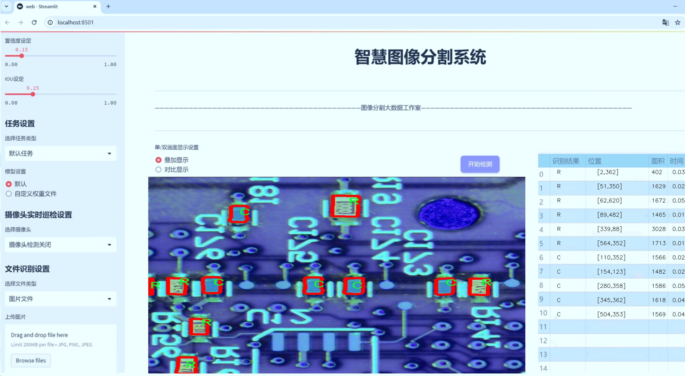
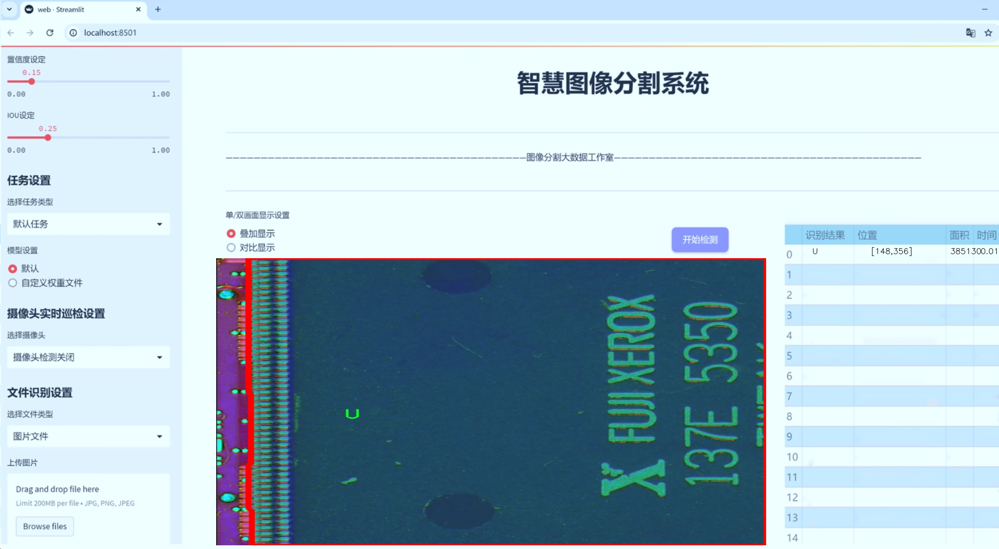
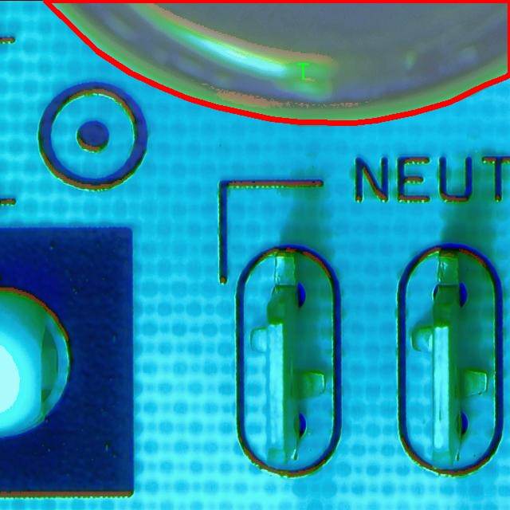
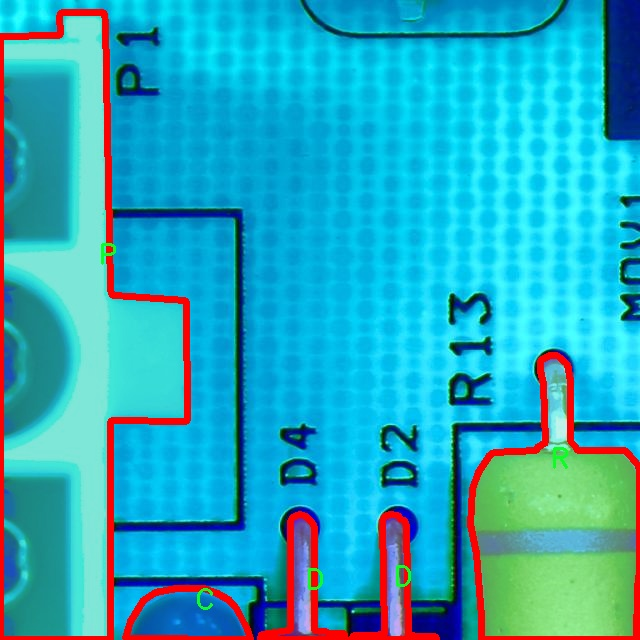
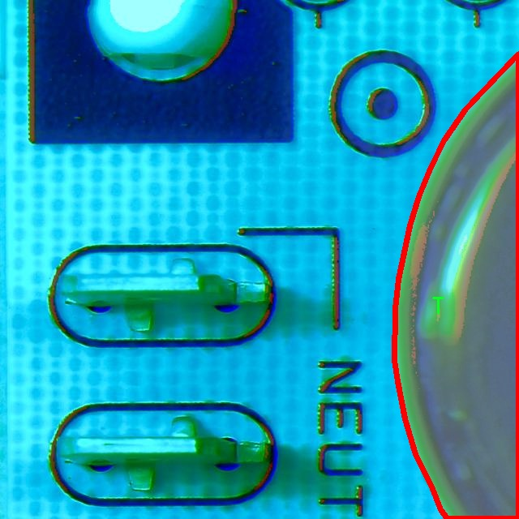
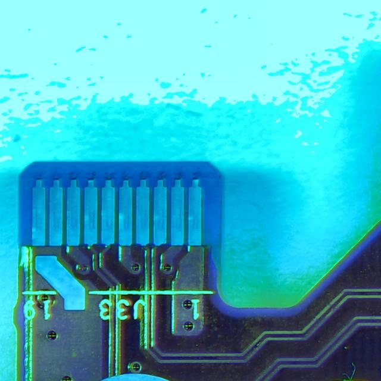
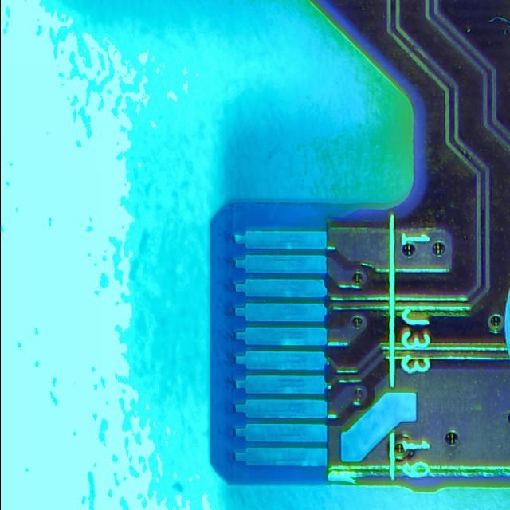

# PCB组件实例分割系统源码＆数据集分享
 [yolov8-seg-RepHGNetV2＆yolov8-seg-p6等50+全套改进创新点发刊_一键训练教程_Web前端展示]

### 1.研究背景与意义

项目参考[ILSVRC ImageNet Large Scale Visual Recognition Challenge](https://gitee.com/YOLOv8_YOLOv11_Segmentation_Studio/projects)

项目来源[AAAI Global Al lnnovation Contest](https://kdocs.cn/l/cszuIiCKVNis)

研究背景与意义

随着电子技术的迅猛发展，印刷电路板（PCB）作为电子设备的核心组成部分，其设计与制造的复杂性日益增加。PCB的组件种类繁多，包括按钮（BTN）、电容（C）、电阻（R）、集成电路（IC）等，涉及到25个不同的类别。为了确保PCB的功能性和可靠性，组件的精确识别与分割显得尤为重要。传统的PCB检测方法往往依赖于人工视觉或基于规则的算法，这些方法不仅效率低下，而且容易受到人为因素的影响，导致检测结果的不一致性和误差。因此，开发一种高效、准确的PCB组件实例分割系统具有重要的理论和实际意义。

近年来，深度学习技术的快速发展为图像处理领域带来了革命性的变化，尤其是在目标检测和实例分割任务中。YOLO（You Only Look Once）系列模型因其高效的实时检测能力而受到广泛关注。YOLOv8作为该系列的最新版本，结合了更为先进的网络结构和优化算法，能够在保持高精度的同时显著提高处理速度。然而，针对PCB组件的实例分割任务，YOLOv8仍存在一定的局限性，尤其是在复杂背景和小目标检测方面。因此，基于改进YOLOv8的PCB组件实例分割系统的研究，不仅能够提升PCB检测的准确性和效率，还能够为电子制造行业的自动化和智能化提供有力支持。

本研究将利用一个包含6300张图像的数据集，该数据集涵盖了25种不同类别的PCB组件，具有较高的多样性和代表性。通过对该数据集的深入分析与处理，结合改进的YOLOv8模型，我们期望能够实现对PCB组件的高效实例分割。这一研究不仅能够为PCB的自动检测提供技术支持，还能够为相关领域的研究提供数据基础和理论指导。

此外，随着工业4.0和智能制造的推进，自动化检测技术在PCB生产中的应用越来越广泛。基于改进YOLOv8的实例分割系统，能够在生产线上实现实时监控和质量控制，降低人工成本，提高生产效率。同时，该系统的成功应用将为其他领域的图像分割任务提供借鉴，推动深度学习技术在更多实际场景中的应用。

综上所述，基于改进YOLOv8的PCB组件实例分割系统的研究，不仅具有重要的学术价值，还具有广泛的应用前景。通过本研究，我们希望能够为PCB行业的智能化发展贡献一份力量，同时为深度学习技术在工业应用中的推广提供新的思路和方法。

### 2.图片演示







##### 注意：由于此博客编辑较早，上面“2.图片演示”和“3.视频演示”展示的系统图片或者视频可能为老版本，新版本在老版本的基础上升级如下：（实际效果以升级的新版本为准）

  （1）适配了YOLOV8的“目标检测”模型和“实例分割”模型，通过加载相应的权重（.pt）文件即可自适应加载模型。

  （2）支持“图片识别”、“视频识别”、“摄像头实时识别”三种识别模式。

  （3）支持“图片识别”、“视频识别”、“摄像头实时识别”三种识别结果保存导出，解决手动导出（容易卡顿出现爆内存）存在的问题，识别完自动保存结果并导出到tempDir中。

  （4）支持Web前端系统中的标题、背景图等自定义修改，后面提供修改教程。

  另外本项目提供训练的数据集和训练教程,暂不提供权重文件（best.pt）,需要您按照教程进行训练后实现图片演示和Web前端界面演示的效果。

### 3.视频演示

[3.1 视频演示](https://www.bilibili.com/video/BV14221YwE9t/)

### 4.数据集信息展示

##### 4.1 本项目数据集详细数据（类别数＆类别名）

nc: 25
names: ['BTN', 'C', 'CR', 'CRA', 'D', 'F', 'FB', 'IC', 'J', 'JP', 'L', 'LED', 'M', 'P', 'Q', 'QA', 'R', 'RA', 'RN', 'S', 'SW', 'T', 'TP', 'U', 'V']


##### 4.2 本项目数据集信息介绍

数据集信息展示

在现代电子制造业中，印刷电路板（PCB）作为电子设备的核心组成部分，其组件的准确识别与分割对于自动化生产线的效率和产品质量至关重要。为此，我们构建了一个名为“PCB Seg”的数据集，旨在为改进YOLOv8-seg的PCB组件实例分割系统提供高质量的训练数据。该数据集包含25个不同类别的PCB组件，每个类别都代表了电子产品中常见的部件，具体类别包括：按钮（BTN）、电容（C）、电阻（R）、电感（L）、LED灯（LED）、集成电路（IC）、连接器（JP）、晶体管（T）等。这些组件在PCB上扮演着不同的角色，各自具有独特的形状和功能，因而在图像分割任务中具有挑战性。

“PCB Seg”数据集的构建过程经过精心设计，确保每个类别的样本数量充足且多样化。我们从多个真实的PCB图像中提取了这些组件，涵盖了不同的制造工艺、材料和尺寸。数据集中不仅包含了标准的PCB图像，还考虑了不同的拍摄角度、光照条件和背景干扰，以增强模型的鲁棒性。每个图像都经过精确的标注，确保每个组件的边界框和分割掩码都能准确反映其在PCB上的位置和形状。这种高质量的标注是实现高效实例分割的基础，能够帮助模型更好地学习到各个组件的特征。

此外，为了提升数据集的实用性和可扩展性，我们还进行了数据增强处理。通过旋转、缩放、裁剪和颜色变换等技术，生成了多样化的训练样本，从而有效增加了数据集的规模。这种增强不仅提高了模型的泛化能力，还能帮助其在面对不同的实际应用场景时，依然保持良好的性能。

在训练过程中，YOLOv8-seg模型将利用“PCB Seg”数据集进行端到端的学习。该模型以其高效的特征提取能力和快速的推理速度，能够在实时检测任务中发挥重要作用。通过对数据集的深度学习，模型将能够准确识别和分割出PCB上的各个组件，为后续的自动化检测和装配提供支持。

综上所述，“PCB Seg”数据集不仅为改进YOLOv8-seg的PCB组件实例分割系统提供了丰富的训练数据，还通过精确的标注和多样化的样本设计，确保了模型在实际应用中的有效性和可靠性。随着电子产品日益复杂化，对PCB组件的自动化识别需求也愈加迫切，而“PCB Seg”数据集的构建无疑为这一领域的研究和应用提供了坚实的基础。通过不断优化和扩展该数据集，我们期待能够推动PCB组件识别技术的进一步发展，助力智能制造的未来。











### 5.全套项目环境部署视频教程（零基础手把手教学）

[5.1 环境部署教程链接（零基础手把手教学）](https://www.bilibili.com/video/BV1jG4Ve4E9t/?vd_source=bc9aec86d164b67a7004b996143742dc)


[5.2 安装Python虚拟环境创建和依赖库安装视频教程链接（零基础手把手教学）](https://www.bilibili.com/video/BV1nA4VeYEze/?vd_source=bc9aec86d164b67a7004b996143742dc)

### 6.手把手YOLOV8-seg训练视频教程（零基础小白有手就能学会）

[6.1 手把手YOLOV8-seg训练视频教程（零基础小白有手就能学会）](https://www.bilibili.com/video/BV1cA4VeYETe/?vd_source=bc9aec86d164b67a7004b996143742dc)


按照上面的训练视频教程链接加载项目提供的数据集，运行train.py即可开始训练



     Epoch   gpu_mem       box       obj       cls    labels  img_size
     1/200     0G   0.01576   0.01955  0.007536        22      1280: 100%|██████████| 849/849 [14:42<00:00,  1.04s/it]
               Class     Images     Labels          P          R     mAP@.5 mAP@.5:.95: 100%|██████████| 213/213 [01:14<00:00,  2.87it/s]
                 all       3395      17314      0.994      0.957      0.0957      0.0843

     Epoch   gpu_mem       box       obj       cls    labels  img_size
     2/200     0G   0.01578   0.01923  0.007006        22      1280: 100%|██████████| 849/849 [14:44<00:00,  1.04s/it]
               Class     Images     Labels          P          R     mAP@.5 mAP@.5:.95: 100%|██████████| 213/213 [01:12<00:00,  2.95it/s]
                 all       3395      17314      0.996      0.956      0.0957      0.0845

     Epoch   gpu_mem       box       obj       cls    labels  img_size
     3/200     0G   0.01561    0.0191  0.006895        27      1280: 100%|██████████| 849/849 [10:56<00:00,  1.29it/s]
               Class     Images     Labels          P          R     mAP@.5 mAP@.5:.95: 100%|███████   | 187/213 [00:52<00:00,  4.04it/s]
                 all       3395      17314      0.996      0.957      0.0957      0.0845


### 7.50+种全套YOLOV8-seg创新点代码加载调参视频教程（一键加载写好的改进模型的配置文件）

[7.1 50+种全套YOLOV8-seg创新点代码加载调参视频教程（一键加载写好的改进模型的配置文件）](https://www.bilibili.com/video/BV1Hw4VePEXv/?vd_source=bc9aec86d164b67a7004b996143742dc)

### 8.YOLOV8-seg图像分割算法原理

原始YOLOV8-seg算法原理

YOLOv8-seg算法是YOLO系列中的最新版本，专注于目标检测与分割任务的结合，代表了计算机视觉领域中的一个重要进展。YOLO（You Only Look Once）系列算法自2015年首次提出以来，经历了多个版本的迭代，每个版本都在精度、速度和易用性等方面进行了显著优化。YOLOv8作为这一系列的最新成果，进一步推动了实时目标检测和图像分割技术的发展。

YOLOv8-seg算法的核心在于其高效的网络结构，主要由输入层、Backbone骨干网络、Neck特征融合网络和Head检测模块四个部分组成。输入层负责对输入图像进行预处理，包括调整图像比例、实现Mosaic增强以及瞄点计算等。这些预处理步骤不仅提高了模型的训练效率，还增强了其对不同场景和目标的适应能力。

在Backbone部分，YOLOv8-seg采用了改进的DarkNet结构，使用C2f模块替代了传统的C3模块。这一改动旨在提高特征提取的效率，特别是在不同尺度目标的检测中，C2f模块能够更好地保留和传递梯度信息，确保网络在进行特征提取时能够捕捉到更丰富的上下文信息。此外，YOLOv8的Backbone在通道数的设置上进行了精细调整，以适应不同规模的模型，确保在保持轻量级特性的同时，最大化特征的表达能力。

特征融合是YOLOv8-seg的另一个关键环节，Neck部分采用了“双塔结构”，结合了特征金字塔网络（FPN）和路径聚合网络（PAN）。这种结构的设计使得语义特征和定位特征能够有效地融合，从而增强了网络对不同尺度目标的检测能力。特征金字塔网络通过多层次的特征图融合，确保了模型在处理复杂场景时，能够充分利用不同层次的特征信息。而路径聚合网络则通过有效的特征传递，进一步提升了特征的表达能力，使得YOLOv8-seg在目标检测和分割任务中表现出色。

在Head部分，YOLOv8-seg引入了三个解耦头的结构，分别负责目标的分类、定位和分割任务。这种解耦设计的优势在于，它将不同的任务分开处理，减少了任务之间的干扰，从而加速了模型的收敛速度，并提高了整体的检测精度。通过将回归分支和预测分支进行分离，YOLOv8-seg能够在进行目标检测的同时，精确地进行像素级的分割，满足复杂应用场景的需求。

YOLOv8-seg算法的另一个显著特点是其对多尺度训练和测试的支持。通过在训练过程中引入多尺度图像，模型能够学习到不同尺度下的目标特征，从而在实际应用中具备更强的适应性。这一策略有效地提升了模型在各种场景下的表现，使得YOLOv8-seg在智能监控、自动驾驶、人脸识别等领域展现出广泛的应用潜力。

此外，YOLOv8-seg还具备原生支持自定义数据集的能力，使得用户可以根据特定需求快速调整模型参数和结构。这一特性极大地增强了模型的灵活性和可扩展性，使得研究人员和开发者能够根据实际应用场景进行定制化的优化。

总的来说，YOLOv8-seg算法通过其高效的网络结构、精细的特征融合机制和灵活的任务解耦设计，成功地将目标检测与分割任务结合在一起，成为当前计算机视觉领域中的一项重要技术。其在精度和速度上的显著提升，使得YOLOv8-seg不仅在学术研究中备受关注，也在工业应用中展现出强大的生命力。随着技术的不断进步，YOLOv8-seg有望在更多复杂的视觉任务中发挥重要作用，推动计算机视觉技术的进一步发展。


### 9.系统功能展示（检测对象为举例，实际内容以本项目数据集为准）

图9.1.系统支持检测结果表格显示

  图9.2.系统支持置信度和IOU阈值手动调节

  图9.3.系统支持自定义加载权重文件best.pt(需要你通过步骤5中训练获得)

  图9.4.系统支持摄像头实时识别

  图9.5.系统支持图片识别

  图9.6.系统支持视频识别

  图9.7.系统支持识别结果文件自动保存

  图9.8.系统支持Excel导出检测结果数据


### 10.50+种全套YOLOV8-seg创新点原理讲解（非科班也可以轻松写刊发刊，V11版本正在科研待更新）

#### 10.1 由于篇幅限制，每个创新点的具体原理讲解就不一一展开，具体见下列网址中的创新点对应子项目的技术原理博客网址【Blog】：


[10.1 50+种全套YOLOV8-seg创新点原理讲解链接](https://gitee.com/qunmasj/good)

#### 10.2 部分改进模块原理讲解(完整的改进原理见上图和技术博客链接)【如果此小节的图加载失败可以通过CSDN或者Github搜索该博客的标题访问原始博客，原始博客图片显示正常】
### YOLOv8简介

YOLOv8 是 Ultralytics 公司继 YOLOv5 算法之后开发的下一代算法模型，目前支持图像分类、物体检测和实例分割任务。YOLOv8 是一个 SOTA 模型，它建立在之前YOLO 系列模型的成功基础上，并引入了新的功能和改进，以进一步提升性能和灵活性。具体创新包括：一个新的骨干网络、一个新的 Ancher-Free 检测头和一个新的损失函数，可以在从 CPU 到 GPU 的各种硬件平台上运行。注意到ultralytics 并没有直接将开源库命名为 YOLOv8，而是直接使用 Ultralytics这个单词，原因是Ultralytics这个库的定位是算法框架，而非特指某一个特定算法，其希望这个库不仅仅能够用于 YOLO 系列模型，同时也能支持其他的视觉任务如图像分类、实例分割等。下图画图YOLOv8目标检测算法同其他YOLO系列算法（YOLOv5、6、7）的实验对比图，左边是模型参数量对比，右边是速度对比。


下面两个表分别是YOLOv8和YOLOv5（v7.0版本）官方在 COCO Val 2017 数据集上测试结果，从中看出 YOLOv8 相比 YOLOv5 精度提升大，但是 N/S/M 模型相应的参数量、FLOPS等提高了不少。


#### YOLOv8概述
提供了一个全新的SOTA模型，和YOLOv5一样，基于缩放系数也提供了 N/S/M/L/X 尺度的不同大小模型，用于满足不同场景需求，同时支持图像分类、目标检测、实例分割和姿态检测任务
在骨干网络和Neck部分将YOLOv5的C3结构换成了梯度流更丰富的 C2f 结构，并对不同尺度模型调整了不同的通道数，大幅提升了模型性能；需要注意的是C2f 模块中存在Split等操作对特定硬件部署没有之前那么友好


Head部分换成了目前主流的解耦头结构，将分类和检测头分离，同时也从 Anchor-Based换成了Anchor-Free Loss
计算方面采用了 TaskAlignedAssigner 正样本分配策略，并引入了 Distribution Focal Loss
下图画出YOLOv8目标检测算法的整体结构图


#### YOLOv8模型
YOLOv8目标检测算法的模型配置文件如下：


从配置文件可以看出，YOLOv8与YOLOv5模型最明显的差异是使用C2F模块替换了原来的C3模块，两个模块的结构图下图所示。


另外Head 部分变化最大，从原先的耦合头变成了解耦头，并且从 YOLOv5 的 Anchor-Based 变成了 Anchor-Free。其结构对比图如下所示：

### RepViT简介

近年来，与轻量级卷积神经网络(cnn)相比，轻量级视觉变压器(ViTs)在资源受限的移动设备上表现出了更高的性能和更低的延迟。这种改进通常归功于多头自注意模块，它使模型能够学习全局表示。然而，轻量级vit和轻量级cnn之间的架构差异还没有得到充分的研究。在这项研究中，我们重新审视了轻量级cnn的高效设计，并强调了它们在移动设备上的潜力。通过集成轻量级vit的高效架构选择，我们逐步增强了标准轻量级CNN的移动友好性，特别是MobileNetV3。这就产生了一个新的纯轻量级cnn家族，即RepViT。大量的实验表明，RepViT优于现有的轻型vit，并在各种视觉任务中表现出良好的延迟。在ImageNet上，RepViT在iPhone 12上以近1ms的延迟实现了超过80%的top-1精度，据我们所知，这是轻量级模型的第一次。

#### RepViT简介
轻量级模型研究一直是计算机视觉任务中的一个焦点，其目标是在降低计算成本的同时达到优秀的性能。轻量级模型与资源受限的移动设备尤其相关，使得视觉模型的边缘部署成为可能。在过去十年中，研究人员主要关注轻量级卷积神经网络（CNNs）的设计，提出了许多高效的设计原则，包括可分离卷积 、逆瓶颈结构 、通道打乱 和结构重参数化等，产生了 MobileNets ，ShuffleNets和 RepVGG 等代表性模型。

另一方面，视觉 Transformers（ViTs）成为学习视觉表征的另一种高效方案。与 CNNs 相比，ViTs 在各种计算机视觉任务中表现出了更优越的性能。然而，ViT 模型一般尺寸很大，延迟很高，不适合资源受限的移动设备。因此，研究人员开始探索 ViT 的轻量级设计。许多高效的ViTs设计原则被提出，大大提高了移动设备上 ViTs 的计算效率，产生了EfficientFormers ，MobileViTs等代表性模型。这些轻量级 ViTs 在移动设备上展现出了相比 CNNs 的更强的性能和更低的延迟。

轻量级 ViTs 优于轻量级 CNNs 的原因通常归结于多头注意力模块，该模块使模型能够学习全局表征。然而，轻量级 ViTs 和轻量级 CNNs 在块结构、宏观和微观架构设计方面存在值得注意的差异，但这些差异尚未得到充分研究。这自然引出了一个问题：轻量级 ViTs 的架构选择能否提高轻量级 CNN 的性能？在这项工作中，我们结合轻量级 ViTs 的架构选择，重新审视了轻量级 CNNs 的设计。我们的旨在缩小轻量级 CNNs 与轻量级 ViTs 之间的差距，并强调前者与后者相比在移动设备上的应用潜力。


在 ConvNeXt 中，参考该博客提出的基于 ResNet50 架构的基础上通过严谨的理论和实验分析，最终设计出一个非常优异的足以媲美 Swin-Transformer 的纯卷积神经网络架构。同样地，RepViT也是主要通过将轻量级 ViTs 的架构设计逐步整合到标准轻量级 CNN，即MobileNetV3-L，来对其进行针对性地改造（魔改）。在这个过程中，作者们考虑了不同粒度级别的设计元素，并通过一系列步骤达到优化的目标。


详细优化步骤如下：

#### 训练配方的对齐
论文中引入了一种衡量移动设备上延迟的指标，并将训练策略与现有的轻量级 ViTs 对齐。这一步骤主要是为了确保模型训练的一致性，其涉及两个概念，即延迟度量和训练策略的调整。

#### 延迟度量指标
为了更准确地衡量模型在真实移动设备上的性能，作者选择了直接测量模型在设备上的实际延迟，以此作为基准度量。这个度量方法不同于之前的研究，它们主要通过FLOPs或模型大小等指标优化模型的推理速度，这些指标并不总能很好地反映在移动应用中的实际延迟。

#### 训练策略的对齐
这里，将 MobileNetV3-L 的训练策略调整以与其他轻量级 ViTs 模型对齐。这包括使用 AdamW 优化器-ViTs 模型必备的优化器，进行 5 个 epoch 的预热训练，以及使用余弦退火学习率调度进行 300 个 epoch 的训练。尽管这种调整导致了模型准确率的略微下降，但可以保证公平性。

#### 块设计的优化
基于一致的训练设置，作者们探索了最优的块设计。块设计是 CNN 架构中的一个重要组成部分，优化块设计有助于提高网络的性能。

#### 分离 Token 混合器和通道混合器
这块主要是对 MobileNetV3-L 的块结构进行了改进，分离了令牌混合器和通道混合器。原来的 MobileNetV3 块结构包含一个 1x1 扩张卷积，然后是一个深度卷积和一个 1x1 的投影层，然后通过残差连接连接输入和输出。在此基础上，RepViT 将深度卷积提前，使得通道混合器和令牌混合器能够被分开。为了提高性能，还引入了结构重参数化来在训练时为深度滤波器引入多分支拓扑。最终，作者们成功地在 MobileNetV3 块中分离了令牌混合器和通道混合器，并将这种块命名为 RepViT 块。

#### 降低扩张比例并增加宽度
在通道混合器中，原本的扩张比例是 4，这意味着 MLP 块的隐藏维度是输入维度的四倍，消耗了大量的计算资源，对推理时间有很大的影响。为了缓解这个问题，我们可以将扩张比例降低到 2，从而减少了参数冗余和延迟，使得 MobileNetV3-L 的延迟降低到 0.65ms。随后，通过增加网络的宽度，即增加各阶段的通道数量，Top-1 准确率提高到 73.5%，而延迟只增加到 0.89ms！

#### 宏观架构元素的优化
在这一步，本文进一步优化了MobileNetV3-L在移动设备上的性能，主要是从宏观架构元素出发，包括 stem，降采样层，分类器以及整体阶段比例。通过优化这些宏观架构元素，模型的性能可以得到显著提高。

#### 浅层网络使用卷积提取器
ViTs 通常使用一个将输入图像分割成非重叠补丁的 “patchify” 操作作为 stem。然而，这种方法在训练优化性和对训练配方的敏感性上存在问题。因此，作者们采用了早期卷积来代替，这种方法已经被许多轻量级 ViTs 所采纳。对比之下，MobileNetV3-L 使用了一个更复杂的 stem 进行 4x 下采样。这样一来，虽然滤波器的初始数量增加到24，但总的延迟降低到0.86ms，同时 top-1 准确率提高到 73.9%。

#### 更深的下采样层
在 ViTs 中，空间下采样通常通过一个单独的补丁合并层来实现。因此这里我们可以采用一个单独和更深的下采样层，以增加网络深度并减少由于分辨率降低带来的信息损失。具体地，作者们首先使用一个 1x1 卷积来调整通道维度，然后将两个 1x1 卷积的输入和输出通过残差连接，形成一个前馈网络。此外，他们还在前面增加了一个 RepViT 块以进一步加深下采样层，这一步提高了 top-1 准确率到 75.4%，同时延迟为 0.96ms。

#### 更简单的分类器
在轻量级 ViTs 中，分类器通常由一个全局平均池化层后跟一个线性层组成。相比之下，MobileNetV3-L 使用了一个更复杂的分类器。因为现在最后的阶段有更多的通道，所以作者们将它替换为一个简单的分类器，即一个全局平均池化层和一个线性层，这一步将延迟降低到 0.77ms，同时 top-1 准确率为 74.8%。

#### 整体阶段比例
阶段比例代表了不同阶段中块数量的比例，从而表示了计算在各阶段中的分布。论文选择了一个更优的阶段比例 1:1:7:1，然后增加网络深度到 2:2:14:2，从而实现了一个更深的布局。这一步将 top-1 准确率提高到 76.9%，同时延迟为 1.02 ms。

#### 卷积核大小的选择
众所周知，CNNs 的性能和延迟通常受到卷积核大小的影响。例如，为了建模像 MHSA 这样的远距离上下文依赖，ConvNeXt 使用了大卷积核，从而实现了显著的性能提升。然而，大卷积核对于移动设备并不友好，因为它的计算复杂性和内存访问成本。MobileNetV3-L 主要使用 3x3 的卷积，有一部分块中使用 5x5 的卷积。作者们将它们替换为3x3的卷积，这导致延迟降低到 1.00ms，同时保持了76.9%的top-1准确率。

#### SE 层的位置
自注意力模块相对于卷积的一个优点是根据输入调整权重的能力，这被称为数据驱动属性。作为一个通道注意力模块，SE层可以弥补卷积在缺乏数据驱动属性上的限制，从而带来更好的性能。MobileNetV3-L 在某些块中加入了SE层，主要集中在后两个阶段。然而，与分辨率较高的阶段相比，分辨率较低的阶段从SE提供的全局平均池化操作中获得的准确率提升较小。作者们设计了一种策略，在所有阶段以交叉块的方式使用SE层，从而在最小的延迟增量下最大化准确率的提升，这一步将top-1准确率提升到77.4%，同时延迟降低到0.87ms。

注意！【这一点其实百度在很早前就已经做过实验比对得到过这个结论了，SE 层放置在靠近深层的地方效果好】

#### 微观设计的调整
RepViT 通过逐层微观设计来调整轻量级 CNN，这包括选择合适的卷积核大小和优化挤压-激励（Squeeze-and-excitation，简称SE）层的位置。这两种方法都能显著改善模型性能。

#### 网络架构
最终，通过整合上述改进策略，我们便得到了模型RepViT的整体架构，该模型有多个变种，例如RepViT-M1/M2/M3。同样地，不同的变种主要通过每个阶段的通道数和块数来区分。


### 11.项目核心源码讲解（再也不用担心看不懂代码逻辑）

#### 11.1 ui.py

以下是经过精简和注释的核心代码：

```python
import sys
import subprocess

def run_script(script_path):
    """
    使用当前 Python 环境运行指定的脚本。

    Args:
        script_path (str): 要运行的脚本路径
    """
    # 获取当前 Python 解释器的路径
    python_path = sys.executable

    # 构建运行命令，使用 streamlit 运行指定的脚本
    command = f'"{python_path}" -m streamlit run "{script_path}"'

    # 执行命令并等待其完成
    result = subprocess.run(command, shell=True)
    
    # 检查命令执行结果，如果返回码不为0，表示出错
    if result.returncode != 0:
        print("脚本运行出错。")

# 主程序入口
if __name__ == "__main__":
    # 指定要运行的脚本路径
    script_path = "web.py"  # 假设脚本在当前目录下

    # 调用函数运行脚本
    run_script(script_path)
```

### 代码注释说明：
1. **导入模块**：
   - `sys`：用于获取当前 Python 解释器的路径。
   - `subprocess`：用于执行外部命令。

2. **`run_script` 函数**：
   - 接受一个参数 `script_path`，表示要运行的 Python 脚本的路径。
   - 使用 `sys.executable` 获取当前 Python 解释器的路径。
   - 构建一个命令字符串，使用 `streamlit` 运行指定的脚本。
   - 使用 `subprocess.run` 执行构建的命令，并等待其完成。
   - 检查命令的返回码，如果不为0，打印错误信息。

3. **主程序入口**：
   - 在 `__main__` 模块中，指定要运行的脚本路径（这里假设为 `web.py`）。
   - 调用 `run_script` 函数来执行该脚本。

这个文件名为 `ui.py`，它的主要功能是通过当前的 Python 环境来运行一个指定的脚本，具体来说是一个名为 `web.py` 的脚本。首先，文件导入了几个必要的模块，包括 `sys`、`os` 和 `subprocess`，这些模块分别用于处理系统相关的功能、文件路径和执行外部命令。

在 `run_script` 函数中，首先获取当前 Python 解释器的路径，这样可以确保在正确的环境中运行脚本。接着，构建一个命令字符串，该命令使用 `streamlit` 来运行指定的脚本。`streamlit` 是一个用于构建数据应用的框架，因此这个脚本的目的是启动一个基于 `streamlit` 的应用。

使用 `subprocess.run` 方法来执行构建好的命令。这个方法会在一个新的进程中运行命令，并等待其完成。如果脚本运行过程中出现错误，返回的状态码将不为零，此时会打印出一条错误信息，提示用户脚本运行出错。

在文件的最后部分，使用 `if __name__ == "__main__":` 语句来确保当该文件作为主程序运行时，以下代码才会被执行。这里指定了要运行的脚本路径为 `web.py`，并调用 `run_script` 函数来执行这个脚本。

总的来说，这个文件的功能是为用户提供一个简单的接口，以便在合适的 Python 环境中启动一个基于 `streamlit` 的应用程序。

#### 11.2 ultralytics\nn\autobackend.py

以下是经过简化和注释的核心代码部分，主要关注于 `AutoBackend` 类的初始化和推理功能。

```python
import torch
import torch.nn as nn
from ultralytics.utils import LOGGER, yaml_load
from ultralytics.utils.downloads import attempt_download_asset

class AutoBackend(nn.Module):
    """
    处理 Ultralytics YOLO 模型的动态后端选择。
    支持多种模型格式，便于在不同平台上部署。
    """

    @torch.no_grad()
    def __init__(self, weights='yolov8n.pt', device=torch.device('cpu'), fp16=False, fuse=True, data=None):
        """
        初始化 AutoBackend 进行推理。

        参数:
            weights (str): 模型权重文件的路径，默认为 'yolov8n.pt'。
            device (torch.device): 运行模型的设备，默认为 CPU。
            fp16 (bool): 启用半精度推理，默认为 False。
            fuse (bool): 融合 Conv2D + BatchNorm 层以优化，默认为 True。
            data (str | Path | optional): 额外的 class names 配置文件路径，默认为 None。
        """
        super().__init__()
        w = str(weights)  # 确保权重路径为字符串
        pt = self._model_type(w)  # 获取模型类型
        self.fp16 = fp16  # 是否使用半精度
        self.device = device  # 设备设置

        # 下载模型权重（如果本地不存在）
        if not pt:
            w = attempt_download_asset(w)

        # 加载模型
        self.model = self._load_model(w, device, fp16, fuse)  # 加载模型并返回

        # 加载类名
        self.names = self._load_class_names(data)  # 加载类名

    def _load_model(self, weights, device, fp16, fuse):
        """
        加载指定格式的模型。

        参数:
            weights (str): 模型权重文件路径。
            device (torch.device): 设备。
            fp16 (bool): 是否使用半精度。
            fuse (bool): 是否融合层。

        返回:
            model: 加载的模型。
        """
        # 根据权重文件的后缀判断模型类型并加载
        # 这里可以根据不同的模型格式进行相应的加载逻辑
        # 例如，PyTorch、ONNX、TensorRT 等
        # 具体实现省略
        pass

    def _load_class_names(self, data):
        """
        加载类名。

        参数:
            data (str | Path): 类名配置文件路径。

        返回:
            names: 类名字典。
        """
        # 加载类名的逻辑
        # 具体实现省略
        pass

    def forward(self, im):
        """
        在 YOLOv8 MultiBackend 模型上运行推理。

        参数:
            im (torch.Tensor): 要进行推理的图像张量。

        返回:
            (tuple): 原始输出张量和处理后的输出（如果需要可视化）。
        """
        # 进行推理的逻辑
        # 具体实现省略
        pass
```

### 代码说明：
1. **类 `AutoBackend`**: 该类用于处理不同格式的 YOLO 模型的推理。它可以根据模型文件的后缀名动态选择后端。

2. **`__init__` 方法**: 初始化方法，接收模型权重、设备、精度等参数，并调用 `_load_model` 和 `_load_class_names` 方法加载模型和类名。

3. **`_load_model` 方法**: 负责根据权重文件的类型加载相应的模型。具体的加载逻辑需要根据不同的模型格式实现。

4. **`_load_class_names` 方法**: 加载类名的逻辑，通常从一个 YAML 文件中读取类名。

5. **`forward` 方法**: 进行推理的核心方法，接收图像张量并返回推理结果。具体的推理逻辑需要根据模型类型实现。

### 注意：
- 具体的模型加载和推理逻辑在此代码中省略，需要根据实际情况进行实现。
- 代码中的注释详细解释了每个方法的功能和参数，便于理解代码的整体结构和逻辑。

这个程序文件 `ultralytics/nn/autobackend.py` 是 Ultralytics YOLO 模型的一部分，主要负责动态选择后端以进行推理。它的设计目标是为不同的推理引擎提供一个抽象层，支持多种模型格式的加载和推理，包括 PyTorch、ONNX、TensorRT、TensorFlow 等。

文件首先导入了一些必要的库和模块，包括标准库的 `ast`、`contextlib`、`json`、`platform` 和 `zipfile`，以及用于图像处理和深度学习的库如 `cv2`、`numpy` 和 `torch`。接着，定义了一个辅助函数 `check_class_names`，用于检查和转换类名，确保它们是可用的，并且符合预期的格式。

`AutoBackend` 类是文件的核心部分，继承自 `torch.nn.Module`。在初始化方法中，接受多个参数，包括模型权重文件路径、设备类型、是否使用 DNN 模块、数据文件路径、是否启用半精度推理等。根据传入的权重文件类型，自动识别并加载相应的模型。支持的模型格式包括 PyTorch、TorchScript、ONNX、OpenVINO、TensorRT、CoreML、TensorFlow 等。对于每种格式，程序会根据需要进行特定的加载和配置。

在 `forward` 方法中，接收输入图像并执行推理。根据模型的类型，选择不同的推理方式，包括直接调用 PyTorch 模型、使用 OpenCV DNN、ONNX Runtime 等。方法还支持数据增强和可视化输出。

此外，类中还定义了一些辅助方法，例如 `from_numpy` 用于将 NumPy 数组转换为 PyTorch 张量，`warmup` 方法用于通过运行一次前向传递来预热模型，以提高后续推理的速度。还有一些静态方法用于处理默认类名和确定模型类型。

总体来说，这个文件的主要功能是提供一个灵活的接口，以便在不同的后端和模型格式之间进行无缝切换，从而简化了模型的部署和推理过程。

#### 11.3 ultralytics\nn\extra_modules\ops_dcnv3\functions\dcnv3_func.py

以下是提取的核心代码部分，并附上详细的中文注释：

```python
import torch
import torch.nn.functional as F
from torch.autograd import Function
from torch.cuda.amp import custom_bwd, custom_fwd

class DCNv3Function(Function):
    @staticmethod
    @custom_fwd
    def forward(ctx, input, offset, mask, kernel_h, kernel_w, stride_h, stride_w, pad_h, pad_w, dilation_h, dilation_w, group, group_channels, offset_scale, im2col_step, remove_center):
        # 保存前向传播所需的参数
        ctx.kernel_h = kernel_h
        ctx.kernel_w = kernel_w
        ctx.stride_h = stride_h
        ctx.stride_w = stride_w
        ctx.pad_h = pad_h
        ctx.pad_w = pad_w
        ctx.dilation_h = dilation_h
        ctx.dilation_w = dilation_w
        ctx.group = group
        ctx.group_channels = group_channels
        ctx.offset_scale = offset_scale
        ctx.im2col_step = im2col_step
        ctx.remove_center = remove_center

        # 准备前向传播的参数
        args = [input, offset, mask, kernel_h, kernel_w, stride_h, stride_w, pad_h, pad_w, dilation_h, dilation_w, group, group_channels, offset_scale, ctx.im2col_step]
        if remove_center:
            args.append(remove_center)

        # 调用DCNv3的前向函数
        output = DCNv3.dcnv3_forward(*args)
        ctx.save_for_backward(input, offset, mask)  # 保存输入以便反向传播使用

        return output

    @staticmethod
    @custom_bwd
    def backward(ctx, grad_output):
        # 获取保存的输入
        input, offset, mask = ctx.saved_tensors

        # 准备反向传播的参数
        args = [input, offset, mask, ctx.kernel_h, ctx.kernel_w, ctx.stride_h, ctx.stride_w, ctx.pad_h, ctx.pad_w, ctx.dilation_h, ctx.dilation_w, ctx.group, ctx.group_channels, ctx.offset_scale, grad_output.contiguous(), ctx.im2col_step]
        if ctx.remove_center:
            args.append(ctx.remove_center)

        # 调用DCNv3的反向函数
        grad_input, grad_offset, grad_mask = DCNv3.dcnv3_backward(*args)

        return grad_input, grad_offset, grad_mask, None, None, None, None, None, None, None, None, None, None, None, None, None

def dcnv3_core_pytorch(input, offset, mask, kernel_h, kernel_w, stride_h, stride_w, pad_h, pad_w, dilation_h, dilation_w, group, group_channels, offset_scale, remove_center):
    # 对输入进行填充
    input = F.pad(input, [0, 0, pad_h, pad_h, pad_w, pad_w])
    N_, H_in, W_in, _ = input.shape
    _, H_out, W_out, _ = offset.shape

    # 获取参考点
    ref = _get_reference_points(input.shape, input.device, kernel_h, kernel_w, dilation_h, dilation_w, pad_h, pad_w, stride_h, stride_w)
    # 生成膨胀网格
    grid = _generate_dilation_grids(input.shape, kernel_h, kernel_w, dilation_h, dilation_w, group, input.device)

    # 计算采样位置
    sampling_locations = (ref + grid * offset_scale).repeat(N_, 1, 1, 1, 1)
    if remove_center:
        sampling_locations = remove_center_sampling_locations(sampling_locations, kernel_w=kernel_w, kernel_h=kernel_h)
    sampling_locations = sampling_locations.flatten(3, 4) + offset * offset_scale

    # 使用grid_sample进行采样
    sampling_input_ = F.grid_sample(input.view(N_, H_in * W_in, group * group_channels).transpose(1, 2).reshape(N_ * group, group_channels, H_in, W_in), sampling_locations, mode='bilinear', padding_mode='zeros', align_corners=False)

    # 计算输出
    output = (sampling_input_ * mask.view(N_, H_out * W_out, group, -1).transpose(1, 2).reshape(N_ * group, 1, H_out * W_out, -1)).sum(-1).view(N_, group * group_channels, H_out * W_out)

    return output.transpose(1, 2).reshape(N_, H_out, W_out, -1).contiguous()
```

### 代码注释说明：
1. **DCNv3Function**: 这个类定义了一个自定义的PyTorch函数，包含前向和反向传播的实现。
   - `forward` 方法负责计算前向传播，保存必要的上下文信息以供反向传播使用。
   - `backward` 方法计算梯度，使用保存的输入和输出梯度进行反向传播。

2. **dcnv3_core_pytorch**: 这个函数实现了DCNv3的核心计算逻辑。
   - 首先对输入进行填充以适应卷积操作。
   - 计算参考点和膨胀网格，用于生成采样位置。
   - 使用 `F.grid_sample` 进行采样，最后计算输出。

3. **辅助函数**: `_get_reference_points` 和 `_generate_dilation_grids` 用于生成参考点和膨胀网格，支持更复杂的卷积操作。

这些代码片段实现了动态卷积的前向和反向传播逻辑，能够处理图像特征提取等任务。

这个程序文件 `dcnv3_func.py` 实现了 DCNv3（Deformable Convolutional Networks v3）中的前向和反向传播功能，主要用于深度学习中的图像处理任务。该文件首先导入了必要的库，包括 PyTorch 及其相关模块。

在文件中，`DCNv3Function` 类继承自 `torch.autograd.Function`，定义了 DCNv3 的前向和反向传播操作。`forward` 方法实现了前向传播，接收输入张量、偏移量、掩码以及卷积的各种参数（如卷积核大小、步幅、填充等）。在此方法中，调用了外部的 `DCNv3` 库中的 `dcnv3_forward` 函数来执行实际的卷积操作，并将输入、偏移量和掩码保存以供反向传播使用。

`backward` 方法实现了反向传播，计算梯度。它使用保存的输入、偏移量和掩码，以及从前向传播中得到的梯度输出，调用 `DCNv3` 库中的 `dcnv3_backward` 函数来计算输入、偏移量和掩码的梯度。

此外，`symbolic` 方法用于在 ONNX（开放神经网络交换）中定义符号操作，方便模型的导出和跨平台使用。

文件中还定义了一些辅助函数，例如 `_get_reference_points` 用于获取参考点，`_generate_dilation_grids` 用于生成膨胀网格，`remove_center_sampling_locations` 用于移除中心采样位置，以及 `dcnv3_core_pytorch` 实现了 DCNv3 的核心功能，处理输入、偏移量和掩码，并返回卷积结果。

整体来看，这个文件实现了 DCNv3 的关键功能，允许在深度学习模型中使用可变形卷积，增强了模型对几何变换的适应能力。

#### 11.4 train.py

以下是代码中最核心的部分，并附上详细的中文注释：

```python
import os
import torch
import yaml
from ultralytics import YOLO  # 导入YOLO模型

if __name__ == '__main__':  # 确保该模块被直接运行时才执行以下代码
    # 设置训练参数
    workers = 1  # 数据加载的工作进程数量
    batch = 8  # 每个批次的样本数量
    device = "0" if torch.cuda.is_available() else "cpu"  # 检查是否有可用的GPU，如果没有则使用CPU

    # 获取数据集的yaml配置文件的绝对路径
    data_path = abs_path(f'datasets/data/data.yaml', path_type='current')

    # 将路径转换为Unix风格的路径
    unix_style_path = data_path.replace(os.sep, '/')
    # 获取目录路径
    directory_path = os.path.dirname(unix_style_path)

    # 读取YAML文件，保持原有顺序
    with open(data_path, 'r') as file:
        data = yaml.load(file, Loader=yaml.FullLoader)

    # 修改YAML文件中的路径项
    if 'train' in data and 'val' in data and 'test' in data:
        data['train'] = directory_path + '/train'  # 设置训练数据路径
        data['val'] = directory_path + '/val'      # 设置验证数据路径
        data['test'] = directory_path + '/test'    # 设置测试数据路径

        # 将修改后的数据写回YAML文件
        with open(data_path, 'w') as file:
            yaml.safe_dump(data, file, sort_keys=False)

    # 加载YOLO模型配置文件和预训练权重
    model = YOLO(r"C:\codeseg\codenew\50+种YOLOv8算法改进源码大全和调试加载训练教程（非必要）\改进YOLOv8模型配置文件\yolov8-seg-C2f-Faster.yaml").load("./weights/yolov8s-seg.pt")

    # 开始训练模型
    results = model.train(
        data=data_path,  # 指定训练数据的配置文件路径
        device=device,  # 指定使用的设备（GPU或CPU）
        workers=workers,  # 指定使用的工作进程数量
        imgsz=640,  # 指定输入图像的大小为640x640
        epochs=100,  # 指定训练的轮数为100
        batch=batch,  # 指定每个批次的样本数量
    )
```

### 代码说明：
1. **导入必要的库**：导入`os`、`torch`、`yaml`和YOLO模型库。
2. **设置训练参数**：定义数据加载的工作进程数量、批次大小和设备（GPU或CPU）。
3. **读取和修改YAML配置文件**：读取数据集的配置文件，修改其中的训练、验证和测试数据路径，并将修改后的内容写回文件。
4. **加载YOLO模型**：根据指定的配置文件和预训练权重加载YOLO模型。
5. **开始训练模型**：调用`model.train()`方法进行模型训练，传入训练数据路径、设备、工作进程数量、图像大小、训练轮数和批次大小等参数。

该程序文件 `train.py` 是一个用于训练 YOLO 模型的 Python 脚本。首先，它导入了必要的库，包括操作系统相关的 `os`、深度学习框架 `torch`、YAML 文件处理库 `yaml`、YOLO 模型库 `ultralytics` 和用于图形界面的 `matplotlib`。在脚本的主入口部分，首先设置了一些训练参数，包括工作进程数、批次大小和设备类型（GPU 或 CPU）。

接下来，程序通过 `abs_path` 函数获取数据集配置文件的绝对路径，并将路径格式转换为 Unix 风格。然后，程序读取该 YAML 文件，解析出训练、验证和测试数据的路径，并根据当前目录进行修改。修改后的路径被写回到 YAML 文件中，以确保后续训练能够正确找到数据。

在模型加载部分，程序使用指定的配置文件加载 YOLO 模型，并且可以选择不同的模型配置以适应不同的硬件要求。最后，调用 `model.train` 方法开始训练，传入训练数据配置文件路径、设备、工作进程数、输入图像大小、训练轮数和批次大小等参数。

整个脚本的目的是为了方便用户在指定的数据集上训练 YOLO 模型，用户可以根据自己的硬件条件和需求调整相关参数。

#### 11.5 ultralytics\utils\dist.py

以下是经过简化和注释的核心代码部分：

```python
import os
import re
import shutil
import socket
import sys
import tempfile
from pathlib import Path

from . import USER_CONFIG_DIR
from .torch_utils import TORCH_1_9

def find_free_network_port() -> int:
    """
    查找本地主机上一个空闲的网络端口。
    
    这个函数在单节点训练时非常有用，当我们不想连接到真实的主节点时，
    但仍需设置 `MASTER_PORT` 环境变量。
    """
    with socket.socket(socket.AF_INET, socket.SOCK_STREAM) as s:
        s.bind(('127.0.0.1', 0))  # 绑定到本地地址和随机端口
        return s.getsockname()[1]  # 返回绑定的端口号

def generate_ddp_file(trainer):
    """生成一个 DDP 文件并返回其文件名。"""
    # 获取训练器的模块和类名
    module, name = f'{trainer.__class__.__module__}.{trainer.__class__.__name__}'.rsplit('.', 1)

    # 构建文件内容
    content = f'''overrides = {vars(trainer.args)} \nif __name__ == "__main__":
    from {module} import {name}
    from ultralytics.utils import DEFAULT_CFG_DICT

    cfg = DEFAULT_CFG_DICT.copy()
    cfg.update(save_dir='')   # 处理额外的 'save_dir' 键
    trainer = {name}(cfg=cfg, overrides=overrides)
    trainer.train()'''
    
    # 创建 DDP 目录
    (USER_CONFIG_DIR / 'DDP').mkdir(exist_ok=True)
    
    # 创建临时文件并写入内容
    with tempfile.NamedTemporaryFile(prefix='_temp_',
                                     suffix=f'{id(trainer)}.py',
                                     mode='w+',
                                     encoding='utf-8',
                                     dir=USER_CONFIG_DIR / 'DDP',
                                     delete=False) as file:
        file.write(content)  # 写入内容到临时文件
    return file.name  # 返回临时文件名

def generate_ddp_command(world_size, trainer):
    """生成并返回用于分布式训练的命令。"""
    import __main__  # 本地导入以避免某些问题
    if not trainer.resume:
        shutil.rmtree(trainer.save_dir)  # 删除保存目录
    
    file = str(Path(sys.argv[0]).resolve())  # 获取当前脚本的绝对路径
    # 定义安全的文件名模式
    safe_pattern = re.compile(r'^[a-zA-Z0-9_. /\\-]{1,128}$')
    
    # 检查文件名是否安全且存在
    if not (safe_pattern.match(file) and Path(file).exists() and file.endswith('.py')):
        file = generate_ddp_file(trainer)  # 生成 DDP 文件
    
    # 根据 PyTorch 版本选择分布式命令
    dist_cmd = 'torch.distributed.run' if TORCH_1_9 else 'torch.distributed.launch'
    port = find_free_network_port()  # 查找空闲端口
    
    # 构建命令
    cmd = [sys.executable, '-m', dist_cmd, '--nproc_per_node', f'{world_size}', '--master_port', f'{port}', file]
    return cmd, file  # 返回命令和文件名

def ddp_cleanup(trainer, file):
    """如果创建了临时文件，则删除它。"""
    if f'{id(trainer)}.py' in file:  # 检查文件名是否包含临时文件后缀
        os.remove(file)  # 删除临时文件
```

### 代码注释说明：
1. **查找空闲端口**：`find_free_network_port` 函数用于查找本地可用的网络端口，以便在分布式训练中使用。
2. **生成 DDP 文件**：`generate_ddp_file` 函数创建一个临时 Python 文件，包含训练器的配置和训练逻辑。
3. **生成分布式训练命令**：`generate_ddp_command` 函数根据训练器的状态和当前脚本的路径生成分布式训练的命令。
4. **清理临时文件**：`ddp_cleanup` 函数用于删除在训练过程中创建的临时文件，以保持文件系统的整洁。

这个程序文件`ultralytics/utils/dist.py`主要用于支持分布式训练，特别是在使用Ultralytics YOLO框架时。文件中包含了一些重要的功能，以下是对代码的逐行讲解。

首先，文件导入了一些必要的模块，包括操作系统、正则表达式、文件操作、网络通信、系统信息、临时文件处理以及路径处理等。这些模块为后续的功能实现提供了基础。

`find_free_network_port`函数用于查找本地主机上一个可用的网络端口。这在单节点训练时非常有用，因为我们不想连接到真实的主节点，但仍需要设置`MASTER_PORT`环境变量。函数通过创建一个TCP socket并绑定到本地地址，自动选择一个可用的端口并返回。

`generate_ddp_file`函数用于生成一个分布式数据并行（DDP）训练的Python文件，并返回该文件的名称。函数首先获取训练器的模块和类名，然后构建一个包含训练配置的Python代码字符串。接着，它在用户配置目录下创建一个名为`DDP`的文件夹（如果不存在的话），并使用临时文件将生成的代码写入。最后，返回临时文件的名称。

`generate_ddp_command`函数用于生成分布式训练的命令。它首先检查训练器是否需要恢复训练，如果不需要，则删除保存目录。接着，它获取当前脚本的路径，并使用正则表达式检查该路径是否安全（即只包含允许的字符且文件存在且以`.py`结尾）。如果不安全，则调用`generate_ddp_file`生成一个临时文件。然后，函数确定使用的分布式命令（根据PyTorch版本选择），查找一个可用的网络端口，并构建最终的命令列表，包含Python解释器、分布式命令、进程数和文件名等信息，最后返回命令和文件名。

`ddp_cleanup`函数用于清理临时文件。如果生成的临时文件的后缀与训练器的ID匹配，则删除该文件。这是为了确保在训练结束后，临时文件不会占用不必要的存储空间。

总体而言，这个文件的功能是为Ultralytics YOLO框架提供分布式训练的支持，自动生成必要的配置文件和命令，并在训练结束后进行清理。通过这些功能，用户可以更方便地进行分布式训练，提高训练效率。

#### 11.6 ultralytics\engine\results.py

以下是代码中最核心的部分，并附上详细的中文注释：

```python
class BaseTensor(SimpleClass):
    """基础张量类，提供额外的方法以便于操作和设备管理。"""

    def __init__(self, data, orig_shape) -> None:
        """
        初始化 BaseTensor，包含数据和原始形状。

        参数:
            data (torch.Tensor | np.ndarray): 预测结果，例如边界框、掩码和关键点。
            orig_shape (tuple): 图像的原始形状。
        """
        assert isinstance(data, (torch.Tensor, np.ndarray))  # 确保数据是张量或数组
        self.data = data  # 存储数据
        self.orig_shape = orig_shape  # 存储原始形状

    @property
    def shape(self):
        """返回数据张量的形状。"""
        return self.data.shape

    def cpu(self):
        """返回在 CPU 内存上的张量副本。"""
        return self if isinstance(self.data, np.ndarray) else self.__class__(self.data.cpu(), self.orig_shape)

    def numpy(self):
        """返回张量的 numpy 数组副本。"""
        return self if isinstance(self.data, np.ndarray) else self.__class__(self.data.numpy(), self.orig_shape)

    def cuda(self):
        """返回在 GPU 内存上的张量副本。"""
        return self.__class__(torch.as_tensor(self.data).cuda(), self.orig_shape)

    def to(self, *args, **kwargs):
        """返回具有指定设备和数据类型的张量副本。"""
        return self.__class__(torch.as_tensor(self.data).to(*args, **kwargs), self.orig_shape)

    def __len__(self):  # 重写 len(results)
        """返回数据张量的长度。"""
        return len(self.data)

    def __getitem__(self, idx):
        """返回指定索引的数据张量副本。"""
        return self.__class__(self.data[idx], self.orig_shape)


class Results(SimpleClass):
    """
    存储和操作推理结果的类。

    参数:
        orig_img (numpy.ndarray): 原始图像的 numpy 数组。
        path (str): 图像文件的路径。
        names (dict): 类别名称的字典。
        boxes (torch.tensor, optional): 每个检测的边界框坐标的 2D 张量。
        masks (torch.tensor, optional): 检测掩码的 3D 张量，每个掩码是一个二进制图像。
        probs (torch.tensor, optional): 每个类别的概率的 1D 张量。
        keypoints (List[List[float]], optional): 每个对象的检测关键点列表。

    属性:
        orig_img (numpy.ndarray): 原始图像的 numpy 数组。
        orig_shape (tuple): 原始图像的形状 (高度, 宽度)。
        boxes (Boxes, optional): 包含检测边界框的 Boxes 对象。
        masks (Masks, optional): 包含检测掩码的 Masks 对象。
        probs (Probs, optional): 包含分类任务每个类别概率的 Probs 对象。
        keypoints (Keypoints, optional): 包含每个对象检测关键点的 Keypoints 对象。
    """

    def __init__(self, orig_img, path, names, boxes=None, masks=None, probs=None, keypoints=None) -> None:
        """初始化 Results 类。"""
        self.orig_img = orig_img  # 存储原始图像
        self.orig_shape = orig_img.shape[:2]  # 存储原始图像的形状
        self.boxes = Boxes(boxes, self.orig_shape) if boxes is not None else None  # 存储边界框
        self.masks = Masks(masks, self.orig_shape) if masks is not None else None  # 存储掩码
        self.probs = Probs(probs) if probs is not None else None  # 存储概率
        self.keypoints = Keypoints(keypoints, self.orig_shape) if keypoints is not None else None  # 存储关键点
        self.names = names  # 存储类别名称
        self.path = path  # 存储图像路径

    def update(self, boxes=None, masks=None, probs=None):
        """更新 Results 对象的 boxes、masks 和 probs 属性。"""
        if boxes is not None:
            self.boxes = Boxes(boxes, self.orig_shape)  # 更新边界框
        if masks is not None:
            self.masks = Masks(masks, self.orig_shape)  # 更新掩码
        if probs is not None:
            self.probs = probs  # 更新概率

    def plot(self, conf=True, boxes=True, masks=True, probs=True):
        """
        在输入 RGB 图像上绘制检测结果。

        参数:
            conf (bool): 是否绘制检测置信度分数。
            boxes (bool): 是否绘制边界框。
            masks (bool): 是否绘制掩码。
            probs (bool): 是否绘制分类概率。

        返回:
            (numpy.ndarray): 注释图像的 numpy 数组。
        """
        # 这里省略了具体的绘制实现
        pass

    def save_txt(self, txt_file, save_conf=False):
        """
        将预测结果保存到 txt 文件中。

        参数:
            txt_file (str): txt 文件路径。
            save_conf (bool): 是否保存置信度分数。
        """
        # 这里省略了具体的保存实现
        pass
```

### 代码核心部分说明：
1. **BaseTensor 类**：这是一个基础类，提供了对张量的基本操作，包括在不同设备（CPU、GPU）之间的转换，以及将张量转换为 numpy 数组的功能。

2. **Results 类**：这个类用于存储推理结果，包括原始图像、边界框、掩码、概率和关键点等。它提供了更新和绘制结果的方法，以及将结果保存到文件的功能。

3. **update 方法**：用于更新检测结果，包括边界框、掩码和概率。

4. **plot 方法**：用于在图像上绘制检测结果，支持绘制边界框、掩码和置信度等信息。

5. **save_txt 方法**：将检测结果保存到文本文件中，便于后续处理和分析。

这个程序文件 `ultralytics/engine/results.py` 是一个用于处理推理结果的类库，主要与目标检测和图像分割相关。它定义了一些类来存储和操作检测结果，包括边界框、掩膜、关键点和分类概率等。

首先，`BaseTensor` 类是一个基础类，提供了一些用于张量操作的方法，比如在 CPU 和 GPU 之间转换、获取 numpy 数组等。它的构造函数接受数据和原始图像的形状，并提供了一些属性和方法来方便地访问和操作这些数据。

接下来是 `Results` 类，它用于存储和操作推理结果。这个类的构造函数接受原始图像、图像路径、类别名称以及可选的边界框、掩膜、概率和关键点数据。它提供了许多方法，例如更新检测结果、将结果转换为不同的设备、绘制检测结果、保存结果到文件等。

`Boxes`、`Masks`、`Keypoints` 和 `Probs` 类分别用于处理边界框、掩膜、关键点和分类概率。这些类继承自 `BaseTensor`，并提供了特定于每种数据类型的属性和方法。例如，`Boxes` 类提供了获取边界框坐标、置信度和类别的方法，而 `Masks` 类则处理分割掩膜的相关操作。

在 `Results` 类中，有一个 `plot` 方法用于在输入图像上绘制检测结果，包括边界框、掩膜、关键点和分类概率。该方法支持多种参数配置，例如是否显示置信度、线宽、字体大小等。

此外，`Results` 类还提供了 `save_txt` 和 `tojson` 方法，用于将检测结果保存为文本文件或 JSON 格式。`save_crop` 方法则用于保存裁剪后的检测结果。

总的来说，这个文件提供了一套完整的工具，用于处理目标检测和图像分割的推理结果，方便用户对结果进行分析、可视化和保存。

### 12.系统整体结构（节选）

### 整体功能和构架概括

该项目是一个基于 Ultralytics YOLO 框架的深度学习目标检测和图像分割系统。其主要功能包括模型训练、推理、结果处理和分布式训练支持。项目的架构由多个模块组成，每个模块负责特定的功能，便于代码的维护和扩展。

- **训练模块**：负责模型的训练过程，包括数据加载、模型配置和训练参数设置。
- **推理模块**：处理模型推理的逻辑，包括选择合适的后端、执行推理和结果存储。
- **结果处理模块**：用于处理和可视化推理结果，包括边界框、掩膜和关键点的处理。
- **分布式训练支持**：提供分布式训练的功能，允许在多个 GPU 或节点上并行训练模型。

### 文件功能整理表

| 文件路径                                                      | 功能描述                                                   |
|-----------------------------------------------------------|--------------------------------------------------------|
| `ui.py`                                                  | 提供一个接口来运行指定的 `web.py` 脚本，启动基于 Streamlit 的应用。 |
| `ultralytics/nn/autobackend.py`                         | 动态选择后端以进行推理，支持多种模型格式的加载和推理。        |
| `ultralytics/nn/extra_modules/ops_dcnv3/functions/dcnv3_func.py` | 实现 DCNv3 的前向和反向传播功能，支持可变形卷积操作。         |
| `train.py`                                              | 负责训练 YOLO 模型，设置训练参数并调用训练过程。            |
| `ultralytics/utils/dist.py`                             | 支持分布式训练，生成必要的配置文件和命令，并进行清理。        |
| `ultralytics/engine/results.py`                         | 处理推理结果，包括边界框、掩膜、关键点和分类概率的存储和操作。 |
| `ultralytics/models/rtdetr/__init__.py`                | 初始化 RT-DETR 模型，提供模型的导入和配置功能。             |
| `ultralytics/utils/autobatch.py`                        | 实现自动批处理功能，根据设备和内存情况动态调整批次大小。      |
| `ultralytics/trackers/track.py`                         | 实现目标跟踪功能，处理视频流中的目标检测和跟踪。            |
| `ultralytics/nn/backbone/revcol.py`                    | 定义 RevCol 模型的骨干网络，提供特征提取功能。              |
| `ultralytics/nn/extra_modules/ops_dcnv3/modules/dcnv3.py` | 实现 DCNv3 模块的具体功能，支持可变形卷积的操作。           |
| `ultralytics/nn/backbone/fasternet.py`                 | 定义 FastNet 模型的骨干网络，提供快速特征提取功能。         |
| `ultralytics/nn/backbone/EfficientFormerV2.py`         | 定义 EfficientFormerV2 模型的骨干网络，优化特征提取效率。   |

这个表格总结了项目中各个文件的主要功能，帮助理解整个系统的架构和各个模块之间的关系。

注意：由于此博客编辑较早，上面“11.项目核心源码讲解（再也不用担心看不懂代码逻辑）”中部分代码可能会优化升级，仅供参考学习，完整“训练源码”、“Web前端界面”和“50+种创新点源码”以“14.完整训练+Web前端界面+50+种创新点源码、数据集获取”的内容为准。

### 13.图片、视频、摄像头图像分割Demo(去除WebUI)代码

在这个博客小节中，我们将讨论如何在不使用WebUI的情况下，实现图像分割模型的使用。本项目代码已经优化整合，方便用户将分割功能嵌入自己的项目中。
核心功能包括图片、视频、摄像头图像的分割，ROI区域的轮廓提取、类别分类、周长计算、面积计算、圆度计算以及颜色提取等。
这些功能提供了良好的二次开发基础。

### 核心代码解读

以下是主要代码片段，我们会为每一块代码进行详细的批注解释：

```python
import random
import cv2
import numpy as np
from PIL import ImageFont, ImageDraw, Image
from hashlib import md5
from model import Web_Detector
from chinese_name_list import Label_list

# 根据名称生成颜色
def generate_color_based_on_name(name):
    ......

# 计算多边形面积
def calculate_polygon_area(points):
    return cv2.contourArea(points.astype(np.float32))

...
# 绘制中文标签
def draw_with_chinese(image, text, position, font_size=20, color=(255, 0, 0)):
    image_pil = Image.fromarray(cv2.cvtColor(image, cv2.COLOR_BGR2RGB))
    draw = ImageDraw.Draw(image_pil)
    font = ImageFont.truetype("simsun.ttc", font_size, encoding="unic")
    draw.text(position, text, font=font, fill=color)
    return cv2.cvtColor(np.array(image_pil), cv2.COLOR_RGB2BGR)

# 动态调整参数
def adjust_parameter(image_size, base_size=1000):
    max_size = max(image_size)
    return max_size / base_size

# 绘制检测结果
def draw_detections(image, info, alpha=0.2):
    name, bbox, conf, cls_id, mask = info['class_name'], info['bbox'], info['score'], info['class_id'], info['mask']
    adjust_param = adjust_parameter(image.shape[:2])
    spacing = int(20 * adjust_param)

    if mask is None:
        x1, y1, x2, y2 = bbox
        aim_frame_area = (x2 - x1) * (y2 - y1)
        cv2.rectangle(image, (x1, y1), (x2, y2), color=(0, 0, 255), thickness=int(3 * adjust_param))
        image = draw_with_chinese(image, name, (x1, y1 - int(30 * adjust_param)), font_size=int(35 * adjust_param))
        y_offset = int(50 * adjust_param)  # 类别名称上方绘制，其下方留出空间
    else:
        mask_points = np.concatenate(mask)
        aim_frame_area = calculate_polygon_area(mask_points)
        mask_color = generate_color_based_on_name(name)
        try:
            overlay = image.copy()
            cv2.fillPoly(overlay, [mask_points.astype(np.int32)], mask_color)
            image = cv2.addWeighted(overlay, 0.3, image, 0.7, 0)
            cv2.drawContours(image, [mask_points.astype(np.int32)], -1, (0, 0, 255), thickness=int(8 * adjust_param))

            # 计算面积、周长、圆度
            area = cv2.contourArea(mask_points.astype(np.int32))
            perimeter = cv2.arcLength(mask_points.astype(np.int32), True)
            ......

            # 计算色彩
            mask = np.zeros(image.shape[:2], dtype=np.uint8)
            cv2.drawContours(mask, [mask_points.astype(np.int32)], -1, 255, -1)
            color_points = cv2.findNonZero(mask)
            ......

            # 绘制类别名称
            x, y = np.min(mask_points, axis=0).astype(int)
            image = draw_with_chinese(image, name, (x, y - int(30 * adjust_param)), font_size=int(35 * adjust_param))
            y_offset = int(50 * adjust_param)

            # 绘制面积、周长、圆度和色彩值
            metrics = [("Area", area), ("Perimeter", perimeter), ("Circularity", circularity), ("Color", color_str)]
            for idx, (metric_name, metric_value) in enumerate(metrics):
                ......

    return image, aim_frame_area

# 处理每帧图像
def process_frame(model, image):
    pre_img = model.preprocess(image)
    pred = model.predict(pre_img)
    det = pred[0] if det is not None and len(det)
    if det:
        det_info = model.postprocess(pred)
        for info in det_info:
            image, _ = draw_detections(image, info)
    return image

if __name__ == "__main__":
    cls_name = Label_list
    model = Web_Detector()
    model.load_model("./weights/yolov8s-seg.pt")

    # 摄像头实时处理
    cap = cv2.VideoCapture(0)
    while cap.isOpened():
        ret, frame = cap.read()
        if not ret:
            break
        ......

    # 图片处理
    image_path = './icon/OIP.jpg'
    image = cv2.imread(image_path)
    if image is not None:
        processed_image = process_frame(model, image)
        ......

    # 视频处理
    video_path = ''  # 输入视频的路径
    cap = cv2.VideoCapture(video_path)
    while cap.isOpened():
        ret, frame = cap.read()
        ......
```


### 14.完整训练+Web前端界面+50+种创新点源码、数据集获取


# [下载链接：https://mbd.pub/o/bread/ZpyZlZxp](https://mbd.pub/o/bread/ZpyZlZxp)